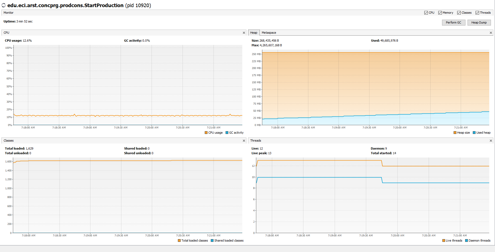
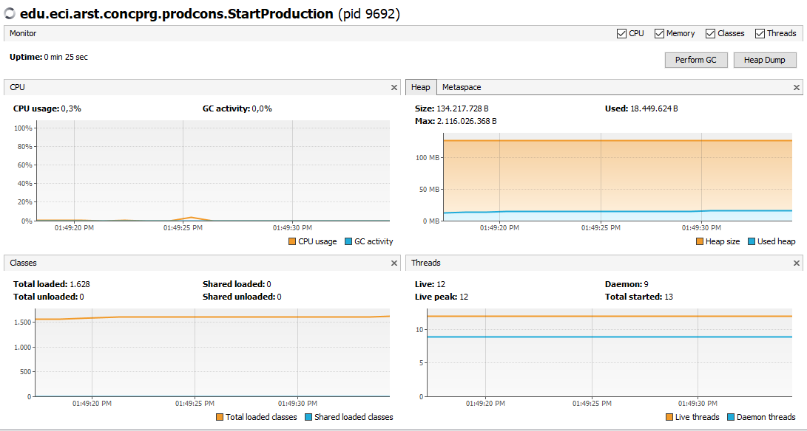
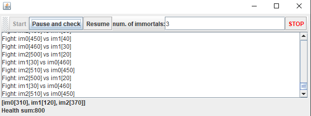

# LAB2-ARSW

## Part I - Before finishing class
1. Check the operation of the program and run it. While this occurs, run jVisualVM and check the CPU consumption of the corresponding process. Why is this consumption? Which is the responsible class?
Este consumo se debe a que se estan ejecutando dos hilos al mismo tiempo constantemente. La clase responsable del mal uso de la CPU es la clase de consumidor ya que esta se encuentra constantemente ejecutandose incluso 
cuando no hay algun elemento que extraer.

2. Make the necessary adjustments so that the solution uses the CPU more efficiently, taking into account that - for now - production is slow and consumption is fast. Verify with JVisualVM that the CPU consumption is reduced. 

## Part II
2. Review the code and identify how the functionality indicated above was implemented. Given the intention of the game, an invariant should be that the sum of the life points of all players is always the same (of course, in an instant of time in which a time increase / reduction operation is not in process ). For this case, for N players, what should this value be?  
La suma de la vida de los N jugadores seria la multiplicación de N por DEFAULT_IMMORTAL_HEALTH.
3. Run the application and verify how the ‘pause and check’ option works. Is the invariant fulfilled?  
No, no se cumple ya que la suma presentada en pantalla es mayor a la que deberia ser.  

4. A first hypothesis that the race condition for this function (pause and check) is presented is that the program consults the list whose values ​​it will print, while other threads modify their values. To correct this, do whatever is necessary so that, before printing the current results, all other threads are paused. Additionally, implement the ‘resume’ option.  
Para realizar el correcto menejo de los hilos usamos monitores y con un entero atómico saber el número de hilos que estan pausados y con esto conocer el momento en el que todos los hilos se han pausado para asi realizar la suma.  
5. Check the operation again (click the button many times). Is the invariant fulfilled or not ?.  
A pesar de haber hecho de manera correcta la sinconización de los hilos el resultado sigue siendo un numero errado.  
